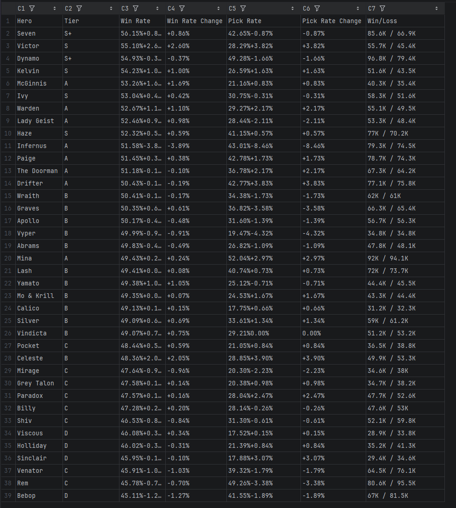
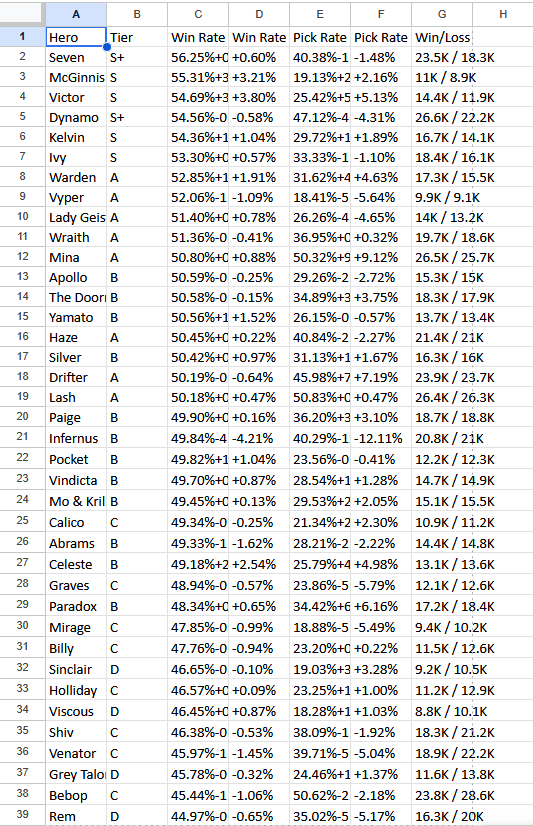
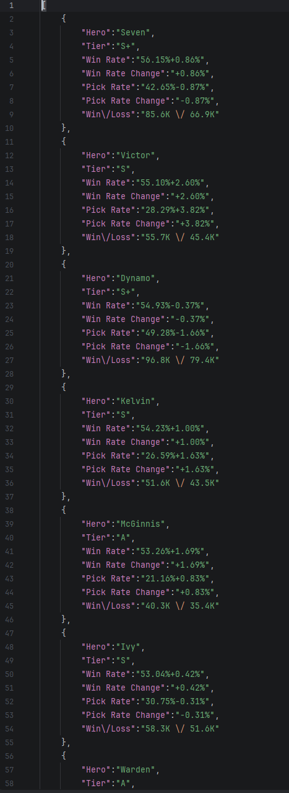

# Deadlock Hero Stats Parser

Парсер тир-листа героев игры Deadlock с сайта [Tracklock.gg](https://tracklock.gg).  
Собирает статистику героев и сохраняет в CSV, Excel и JSON.

## Стек

- Python 3.14
- Playwright (Async)
- Pandas

## Результат

CSV:

Excel:

JSON:

## Как запустить

1. Клонируйте репозиторий: `git clone https://github.com/iseed3adpeople/TrackLock-Parser.git`
2. Установите uv: `pip install uv`
3. Установите зависимости: `uv sync`
4. Запустите: `uv run main.py`