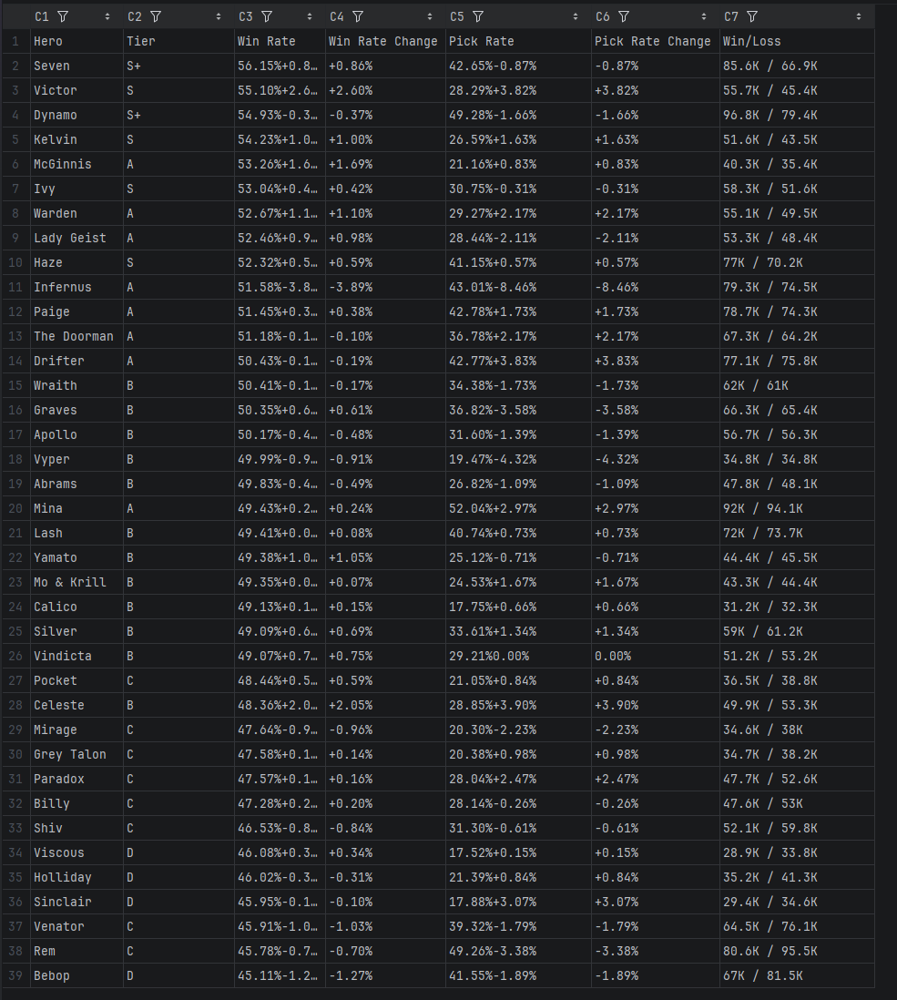
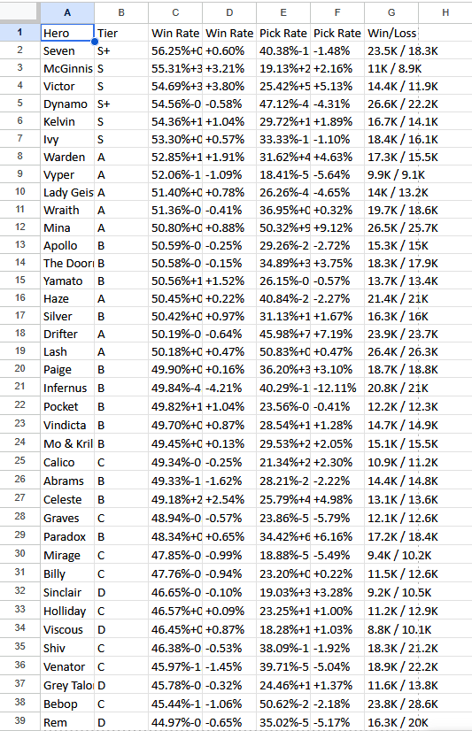
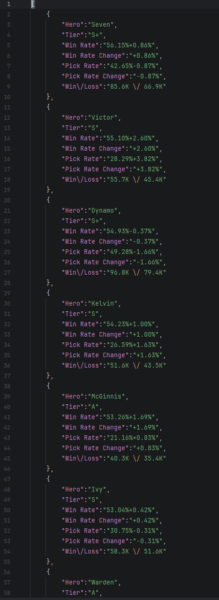

# Deadlock Hero Stats Parser

Парсер тир-листа героев игры Deadlock с сайта [Tracklock.gg](https://tracklock.gg).  
Собирает статистику героев и сохраняет в CSV, Excel и JSON.

## Стек

- Python 3.14
- Playwright (Async)
- Pandas

## Результат

Скрипт создаёт три файла с данными тир-листа:
- `data.csv`
- `data.xlsx`
- `data.json`

## Как запустить

1. Установите uv: `pip install uv`
2. Установите зависимости: `uv sync`
3. Запустите: `uv run main.py`